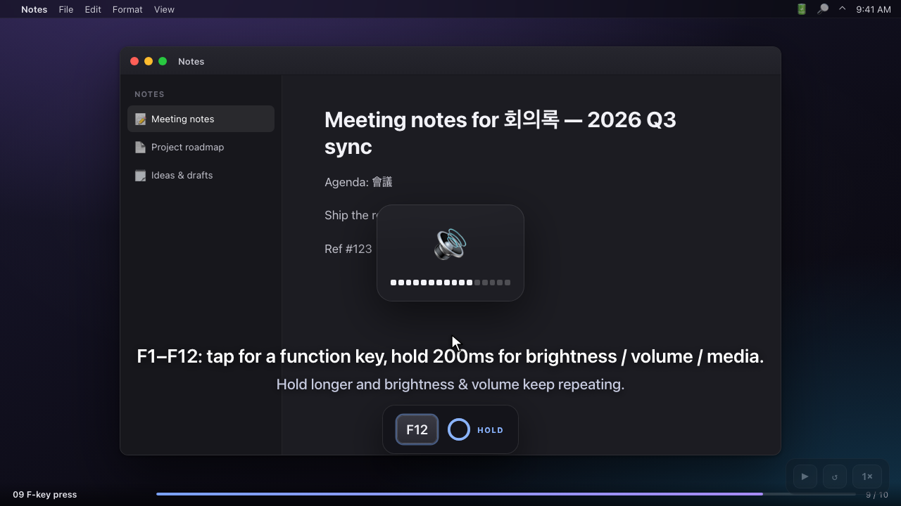
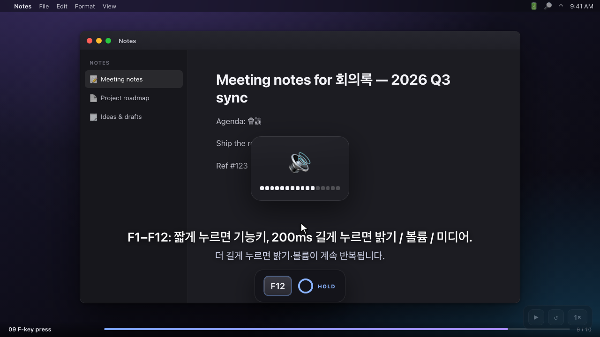

# karabiner-win11-kr

**Windows 11 Korean keyboard habits on macOS, powered by [Karabiner-Elements](https://karabiner-elements.pqrs.org/).**

[English](#english) · [한국어](#한국어)

---

## English

[](https://linchaindev.github.io/karabiner-win11-kr/demo/)

▶︎ **[Watch the demo](https://linchaindev.github.io/karabiner-win11-kr/demo/)** — every feature in one continuous 70-second take, with English subtitles. Runs right in your browser.

A set of [Karabiner-Elements](https://karabiner-elements.pqrs.org/) configurations for Korean users who moved from Windows to macOS. It lets you use the 한/영 (Hangul/English) key, Hanja key, NumLock, and Ctrl shortcuts with the exact same muscle memory you had on Windows 11.

It's especially handy if you plug an external keyboard with a numeric keypad into a MacBook — the NumLock toggle and keypad cursor navigation (Home/End/PgUp/PgDn/arrows/Del) come back to life just like on Windows, so that keypad stops being dead weight. And because Korean/English switching rides the native macOS input-source path, the IME never gets stuck — the switch is seamless, even mid-sentence.

### Features

| Key | Action | Notes |
|---|---|---|
| **Right Cmd** (right of the spacebar) | Toggle Korean/English | Same spot as the Windows 한/영 key. Won't jam even when mashed quickly or overlapped with the next key |
| **Right Opt (Alt)** | Hanja conversion | Press right after typing Hangul to pull up the Hanja candidate list (same as the Windows Hanja key) |
| **NumLock (Clear)** | Toggle keypad mode | Switches between number entry ↔ cursor movement (Home/End/PgUp/PgDn/arrows/Del). Shows a notification on toggle |
| **Ctrl+C / X / V** | Copy / Cut / Paste | In Finder, Ctrl+X → Ctrl+V even performs a **file move** |
| **Ctrl+A/Z/Y/S/F/N/T/W/P/R/L/O** | Select all / Undo / Redo / Save / Find / New window / New tab / Close tab / Print / Reload / Address bar / Open | Shift combos preserved (Ctrl+Shift+T to reopen a closed tab, etc.) |
| **Cmd+Shift+V** | Clipboard history | The Win+V equivalent. Uses the Spotlight clipboard on macOS 26 Tahoe |
| **F1~F12** | Short press = function key, long press (200ms) = brightness/volume/media | Windows-style F-keys by default, macOS special keys when held. Brightness and volume keep repeating while held. F6 is left untouched |

### Design principles

- **Terminals and IDEs are left untouched** — In Terminal, iTerm2, kitty, WezTerm, Warp, Ghostty, Alacritty, Hyper, VS Code, Cursor, and JetBrains apps, the original behavior of Ctrl+C (SIGINT) and friends is preserved.
- **Korean/English switching uses the native path** — Instead of changing the input source directly via API, it fires a globe (fn) key event so it rides the native macOS switching path. This avoids the classic problem of the IME state getting confused in browser input fields.
- **The 한/영 key fires instantly** — The switch completes the moment you press the key, so even with fast-typing habits where you hit the next character before releasing the 한/영 key, Cmd combos won't misfire.
- **Cmd shortcuts stay intact** — All macOS default shortcuts like Cmd+C/V and Cmd+Tab keep working. You can press either Ctrl or Cmd.

### Requirements

- macOS (Apple Silicon / Intel)
- [Karabiner-Elements](https://karabiner-elements.pqrs.org/) — the install script sets it up for you automatically
- Clipboard history (Cmd+Shift+V) requires macOS 26 Tahoe or later (all other features are version-independent)

### Installation

#### Option 1: Automatic install script (recommended)

```bash
curl -fsSL https://raw.githubusercontent.com/linchaindev/karabiner-win11-kr/main/release/v1/setup-karabiner.sh | bash
```

What the script does:

1. Checks for Homebrew (installs it if missing)
2. Installs Karabiner-Elements (skips if already present)
3. Backs up your existing Karabiner config, then deploys this one
4. Applies system settings automatically — globe key = change input source, Caps Lock Korean/English toggle off
5. Launches Karabiner (which prompts the permission-approval popup)

#### Option 2: Manual install

```bash
git clone https://github.com/linchaindev/karabiner-win11-kr.git
mkdir -p ~/.config/karabiner/assets
cp karabiner-win11-kr/code/karabiner.json ~/.config/karabiner/
cp -R karabiner-win11-kr/code/complex_modifications ~/.config/karabiner/assets/
defaults write com.apple.HIToolbox AppleFnUsageType -int 1
defaults write com.apple.HIToolbox TISRomanSwitchState -int 0
```

> If you already have a Karabiner config, back up `~/.config/karabiner` first — `karabiner.json` gets replaced wholesale. To keep your existing rules, copy only the files in `code/complex_modifications/` into `~/.config/karabiner/assets/complex_modifications/`, then pick the rules you want from Karabiner UI → Complex Modifications → Add rule.

#### Manual steps after install (macOS security blocks automating these)

1. Approve the driver (system extension) popup
2. System Settings → Privacy & Security → Input Monitoring → allow `karabiner_grabber`
3. (Optional) System Settings → Spotlight → turn on **Clipboard** — for Cmd+Shift+V
4. System Settings → Keyboard → Input Sources: confirm only Korean (2-set) and ABC are present — a third input source can throw off the toggle cycle

### Folder structure

```
├── code/                          # Karabiner config sources
│   ├── karabiner.json             # complete config with all rules enabled
│   └── complex_modifications/     # per-rule files (for selective install)
│       ├── hangul-toggle.json         # 한/영 key + Hanja key
│       ├── windows-style-copy.json    # Ctrl shortcuts + Finder file move
│       ├── numpad-numlock-toggle.json # NumLock toggle
│       ├── spotlight-clipboard.json   # clipboard history
│       └── fn-longpress.json          # F1~F12 short/long dual action
├── demo/                          # browser-playable feature demo (no install needed)
│   ├── index.html                 # English subtitles
│   └── ko.html                    # Korean subtitles
└── release/
    └── v1/
        └── setup-karabiner.sh     # automatic install script (config embedded, single file)
```

### Customization

- **Want only some features?** Install the files in `code/complex_modifications/` individually (see Option 2 above).
- **Editing the terminal/IDE exception list**: add or remove an app's bundle ID in the `bundle_identifiers` array of `windows-style-copy.json`. Find a bundle ID with `osascript -e 'id of app "AppName"'`.
- **Adding a Ctrl-mapped key**: copy one of the manipulators in `windows-style-copy.json` and just change the `key_code`.

### Troubleshooting

| Symptom | Fix |
|---|---|
| Korean/English won't switch | System Settings → Keyboard → check that "Press 🌐 key to" is set to **Change Input Source** |
| Caps Lock also switches Korean/English | System Settings → Keyboard → Edit input sources → turn off "Use Caps Lock to switch to and from ABC" (the script applies this automatically but a re-login may be needed) |
| NumLock toggle doesn't respond | Depending on the keyboard, NumLock arrives as `keypad_num_lock` or `keypad_clear`. Both are mapped, but if it still fails, check the actual key_code with Karabiner-EventViewer |
| Cmd+Shift+V doesn't appear | Requires macOS 26 Tahoe or later + System Settings → Spotlight → Clipboard enabled. If you changed the Spotlight shortcut away from Cmd+Space, the rule needs editing |
| A short F-key press still triggers brightness/volume | System Settings → Keyboard → turn on "Use F1, F2, etc. keys as standard function keys". The hardware fn key still works as before |
| Long press feels too slow/fast | Change both `basic.to_if_alone_timeout_milliseconds` and `basic.to_if_held_down_threshold_milliseconds` in `fn-longpress.json` (default 200) |
| Rules don't work at all | Check Karabiner's Input Monitoring permission and whether the driver was approved |

### License

MIT

---

## 한국어

**Windows 11 한국어 키보드 습관을 macOS에 그대로 이식하는 Karabiner-Elements 설정**

[](https://linchaindev.github.io/karabiner-win11-kr/demo/ko.html)

▶︎ **[데모 영상 보기](https://linchaindev.github.io/karabiner-win11-kr/demo/ko.html)** — 모든 기능을 70초 한 컷에 담았습니다. 브라우저에서 바로 재생됩니다.

윈도우를 오래 쓰다 맥으로 넘어온 한국어 사용자를 위한 설정 모음입니다. 한영키·한자키·NumLock·Ctrl 단축키를 윈도우와 동일한 감각으로 쓸 수 있습니다.

특히 맥북에 숫자 키패드가 달린 외장 키보드를 연결해 쓰는 분에게 유용합니다 — NumLock 토글과 키패드 커서 이동(Home/End/PgUp/PgDn/화살표/Del)이 윈도우처럼 살아나 놀리던 키패드를 제대로 쓰게 됩니다. 한영 전환도 macOS 네이티브 입력 소스 경로를 타기 때문에 IME가 꼬이지 않고 문장 도중에도 매끄럽게 넘어갑니다.

### 기능

| 키 | 동작 | 비고 |
|---|---|---|
| **우측 Cmd** (스페이스바 오른쪽) | 한영 전환 | 윈도우 한영키 위치. 빠르게 연타하거나 다음 키와 겹쳐 눌러도 안 꼬임 |
| **우측 Opt(Alt)** | 한자 변환 | 한글 입력 직후 누르면 한자 후보 목록 (윈도우 한자키와 동일) |
| **NumLock(Clear)** | 키패드 모드 토글 | 숫자 입력 ↔ 커서 이동(Home/End/PgUp/PgDn/화살표/Del) 전환. 토글 시 알림 표시 |
| **Ctrl+C / X / V** | 복사 / 잘라내기 / 붙여넣기 | Finder에서는 Ctrl+X → Ctrl+V로 **파일 이동**까지 지원 |
| **Ctrl+A/Z/Y/S/F/N/T/W/P/R/L/O** | 전체선택/실행취소/재실행/저장/찾기/새창/새탭/탭닫기/인쇄/새로고침/주소창/열기 | Shift 조합 유지 (Ctrl+Shift+T 닫은 탭 복구 등) |
| **Cmd+Shift+V** | 클립보드 히스토리 | Win+V 대응. macOS 26 Tahoe의 Spotlight 클립보드 사용 |
| **F1~F12** | 짧게 = 펑션키, 길게(200ms) = 밝기/볼륨/미디어 | 평소엔 윈도우처럼 F키, 꾹 누르면 macOS 특수키. 밝기·볼륨은 누르고 있는 동안 연속 반복. F6은 건드리지 않음 |

### 설계 원칙

- **터미널·IDE는 건드리지 않음** — Terminal, iTerm2, kitty, WezTerm, Warp, Ghostty, Alacritty, Hyper, VS Code, Cursor, JetBrains 계열에서는 Ctrl+C(SIGINT) 등 원래 기능이 그대로 유지됩니다.
- **한영 전환은 네이티브 경로 사용** — 입력소스를 API로 직접 바꾸지 않고 지구본(fn) 키 이벤트를 발생시켜 macOS 네이티브 전환 경로를 탑니다. 브라우저 입력창에서 IME 상태가 꼬이는 고질적인 문제가 없습니다.
- **한영키는 즉시 발동** — 키를 누르는 순간 전환이 완료되므로, 한영키를 떼기 전에 다음 글자를 치는 빠른 타이핑 습관에서도 Cmd+조합키가 오발동하지 않습니다.
- **Cmd 단축키는 그대로** — Cmd+C/V, Cmd+Tab 등 macOS 기본 단축키는 전부 살아 있습니다. Ctrl과 Cmd 어느 쪽을 눌러도 됩니다.

### 요구 사항

- macOS (Apple Silicon / Intel)
- [Karabiner-Elements](https://karabiner-elements.pqrs.org/) — 설치 스크립트가 자동으로 설치해 줍니다
- 클립보드 히스토리(Cmd+Shift+V)는 macOS 26 Tahoe 이상 필요 (다른 기능은 버전 무관)

### 설치

#### 방법 1: 자동 설치 스크립트 (권장)

```bash
curl -fsSL https://raw.githubusercontent.com/linchaindev/karabiner-win11-kr/main/release/v1/setup-karabiner.sh | bash
```

스크립트가 하는 일:

1. Homebrew 확인 (없으면 설치)
2. Karabiner-Elements 설치 (이미 있으면 건너뜀)
3. 기존 카라비너 설정 백업 후 본 설정 배포
4. 시스템 설정 자동 적용 — 지구본 키 = 입력 소스 변경, Caps Lock 한영 전환 끄기
5. Karabiner 실행 (권한 승인 팝업 유도)

#### 방법 2: 수동 설치

```bash
git clone https://github.com/linchaindev/karabiner-win11-kr.git
mkdir -p ~/.config/karabiner/assets
cp karabiner-win11-kr/code/karabiner.json ~/.config/karabiner/
cp -R karabiner-win11-kr/code/complex_modifications ~/.config/karabiner/assets/
defaults write com.apple.HIToolbox AppleFnUsageType -int 1
defaults write com.apple.HIToolbox TISRomanSwitchState -int 0
```

> 기존 카라비너 설정이 있다면 `~/.config/karabiner`를 먼저 백업하세요. `karabiner.json`이 통째로 교체됩니다. 기존 룰을 유지하고 싶다면 `code/complex_modifications/`의 파일만 `~/.config/karabiner/assets/complex_modifications/`에 넣고 Karabiner UI의 Complex Modifications → Add rule에서 원하는 룰만 선택하세요.

#### 설치 후 수동 확인 (macOS 보안상 자동화 불가)

1. 드라이버(시스템 확장) 허용 팝업 승인
2. 시스템 설정 → 개인정보 보호 및 보안 → 입력 모니터링에서 `karabiner_grabber` 허용
3. (선택) 시스템 설정 → Spotlight → **Clipboard** 켜기 — Cmd+Shift+V용
4. 시스템 설정 → 키보드 → 입력 소스에 한글(두벌식)과 ABC 두 개만 있는지 확인 — 제3의 입력소스가 있으면 한영 토글 순환이 어긋날 수 있습니다

### 폴더 구조

```
├── code/                          # 카라비너 설정 원본
│   ├── karabiner.json             # 전체 룰이 활성화된 완성 설정
│   └── complex_modifications/     # 룰별 개별 파일 (선택 설치용)
│       ├── hangul-toggle.json         # 한영키·한자키
│       ├── windows-style-copy.json    # Ctrl 단축키 + Finder 파일 이동
│       ├── numpad-numlock-toggle.json # NumLock 토글
│       ├── spotlight-clipboard.json   # 클립보드 히스토리
│       └── fn-longpress.json          # F1~F12 숏/롱 이중 동작
├── demo/                          # 브라우저에서 바로 보는 기능 데모 (설치 불필요)
│   ├── index.html                 # 영문 자막
│   └── ko.html                    # 한글 자막
└── release/
    └── v1/
        └── setup-karabiner.sh     # 자동 설치 스크립트 (설정 내장, 단일 파일)
```

### 커스터마이즈

- **일부 기능만 쓰고 싶다면**: `code/complex_modifications/`의 파일을 개별 설치하세요 (위 방법 2 참고).
- **터미널·IDE 예외 목록 수정**: `windows-style-copy.json`의 `bundle_identifiers` 배열에 앱의 번들 ID를 추가/제거하면 됩니다. 번들 ID는 `osascript -e 'id of app "앱이름"'`으로 확인할 수 있습니다.
- **Ctrl 매핑 키 추가**: `windows-style-copy.json`의 manipulator 하나를 복사해서 `key_code`만 바꾸면 됩니다.

### 문제 해결

| 증상 | 해결 |
|---|---|
| 한영 전환이 안 됨 | 시스템 설정 → 키보드 → "지구본 키를 누르면"이 **입력 소스 변경**인지 확인 |
| Caps Lock으로도 한영이 전환됨 | 시스템 설정 → 키보드 → 입력 소스 편집 → "Caps Lock 키로 ABC 입력 소스 전환" 끄기 (스크립트가 자동 적용하지만 재로그인 필요할 수 있음) |
| NumLock 토글이 안 먹음 | 키보드마다 NumLock이 `keypad_num_lock` 또는 `keypad_clear`로 들어옵니다. 둘 다 매핑돼 있지만, 그래도 안 되면 Karabiner-EventViewer로 실제 key_code를 확인하세요 |
| Cmd+Shift+V가 안 뜸 | macOS 26 Tahoe 이상 + 시스템 설정 → Spotlight → Clipboard 활성화 필요. Spotlight 단축키를 Cmd+Space에서 바꿨다면 룰 수정 필요 |
| F키를 짧게 눌러도 밝기·볼륨이 동작 | 시스템 설정 → 키보드 → "F1, F2 등의 키를 표준 기능 키로 사용" 켜기. 하드웨어 fn 키는 그대로 동작합니다 |
| 길게 누르는 시간이 길거나 짧음 | `fn-longpress.json`의 `basic.to_if_alone_timeout_milliseconds`와 `basic.to_if_held_down_threshold_milliseconds`를 함께 조정 (기본 200) |
| 룰이 아예 안 먹음 | Karabiner 입력 모니터링 권한, 드라이버 승인 여부 확인 |

### 라이선스

MIT
